# Introduction

This library provides gesture detection functionality using almost exclusively the IMU data of the Myo Armband.
The gestures are based on arm rotation to work with persons where distinct muscle activity is hard to detect.
Muscle activity is only used for starting/ending the recording of a gesture. Uses the MyoBridge Arduino Library (https://github.com/vroland/MyoBridge).

# Usage

## Syncing

Although this library mostly evades using the muscle activity, it is still needed for the lock/unlock gesture. 
But every user and every armband position is different in terms of signal strength. That is why 
you have to sync before using gesture detection. 

Syncing starts with a long vibration, this should usually the first vibration that occurs
after program startup. After that long vibration, perform a *strong* gesture with your hand.
**But what is a strong gesture?** Generally, any gesture that involves movement against
a force works. This could be a wrist flex, a fist or waving in any direction:

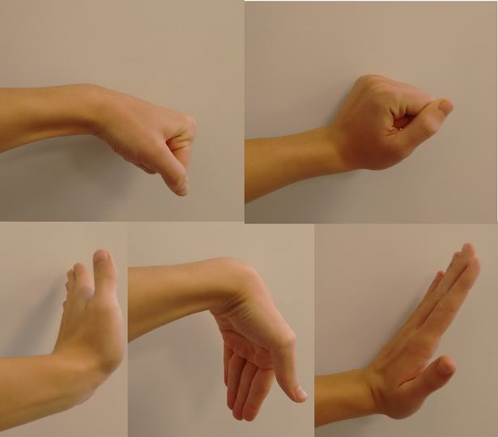

Hold this gesture for a short time. A short vibration will indicate the end of this procedure.
You can now lock or unlock the gesture detection with this gesture.

## Locking/ Unlocking

To indicate when you want to record a gesture, unlock the gesture detection first. Do this
by performing the lock/unlock gesture used when syncing. In the example sketch,
a LED will now indicate that the unlock was successful. Now you can start performing a
gesture. When you are finished, perform the lock/unlock gesture again to finish your command.
The library will now evaluate the gesture and give a notification, if a gesture was detected.
In the example sketch, the recognized gesture is sent via the serial connection and can be read
on a serial monitor.

## Available Gestures

There are generally four types of gestures available: Horizontal Movement, Vertical Movement, Circular Movement
and Arm Rotation. Every type has two opposites: 

| Gesture Type | Subtype 1 (e.g. enable) | Subtype 2 (e.g. disable) |
|--------------|-------------------------|--------------------------|
| Horizontal   | Straight to right       | Straight to right        |
| Vertical     | Straight up             | Straight down            |
| Circular     | Circle clockwise        | Circle counterclockwise  |
| Arm Rotation | Rotate stretched arm CW | Rotate stretched arm CCW |

These images show a demonstration of the gestures above:


### Horizontal:

| Subtype 1 | Subtype 2 |
|-----------|-----------|
| 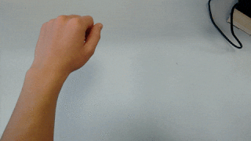 | 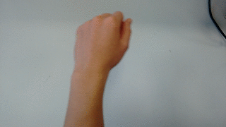 |

### Vertical:

| Subtype 1 | Subtype 2 |
|-----------|-----------|
| 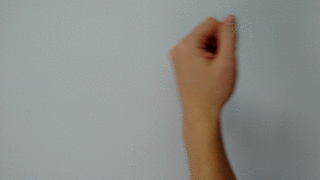 | 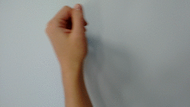 |

### Circular:

| Subtype 1 | Subtype 2 |
|-----------|-----------|
| 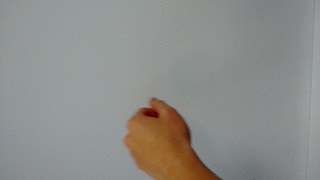 | 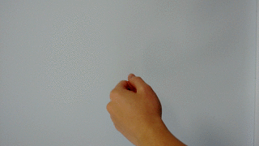 |

### Rotate Arm:

| Subtype 1 | Subtype 2 |
|-----------|-----------|
| 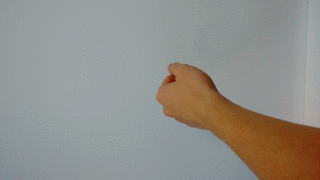 | 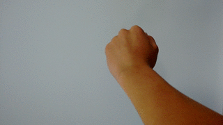 |


## Using the Library for your Sketch

To use the library, all you have to do is calling the initialization function after your program
has connected to Myo:

```C++

// This function is called when a gesture is recognized
void updateControls(GestureType gesture);

// This function is called when a lock/unlock happens
void updateLockOutput(bool locked);

//connected

MyoIMUGestureController::begin(bridge, updateControls, updateLockOutput);
```

*After that, it is not recommended to use the MyoBridge object for anything other than
simple reads or vibration commands!* (See *How it works* for details)
You can now receive gesture data and lock/unlock events from the two callback functions,
`updateControls()` and `updateLockOutput()`. You can also have a look at the example sketch
provided with this library. That's it!

# Software Structure

The diagram below visualizes the overall software structure when using this library:

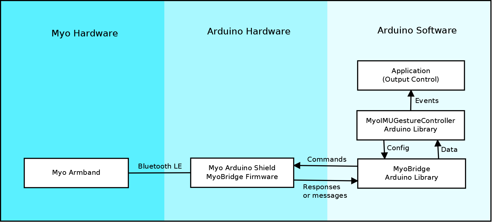

# How it works

## Usage of the MyoBridge Library

This library is built on top of the MyoBridge library. As it is a specific application, extensive
use of the MyoBridge library outside of this library is not recommended. 
The initialization function of this library (`begin()`) performs the following actions with the MyoBridge
object passed to it:

 * activate IMU and EMG data, deactivate pose data
 * set its own internal callbacks for IMU and EMG data
 * disables sleep mode for Myo
 
## How Gestures are Recorded

*Constants regarding this section are defined in MyoIMUGestureController.h*

The library permanently reads the EMG inputs and caches them in a list of size `EMG_CACHE_SIZE` and calculates
the sum of the absolute values of all EMG data in the cache. This procedure is used to avoid flickering of the lock
function, because EMG values are very susceptible to noise. 
During syncing, the highest recorded value of this sum is saved. When the user performs the lock/unlock
gesture after sync, and a threshold of `LOCK_TOGGLE_THRESHOLD * sync_sum` is reached, the lock status
is toggled and the `on_lock_change` callback is called. 

Now that the library is unlocked, the rotation of the user's arm is tracked as value of 
two angles (horizontal rotation and vertical rotation) and saved in a buffer.
As soon as the user locks again using the lock/unlock gesture, the data in this buffer,
together with the lasst roll angle of the users arm are evaluated for gesture recognition.
If the gesture buffer is full before the user locks again, all recorded data is discarded
and the library re-locks, assuming the unlock has happened accidentaly.

## Gesture Evaluation

*Constants regarding this section are defined in gestureAnalysis.h*

When the user has successfully finished a gesture by re-locking, the data stored in the gesture
cache is evalated by the `processCacheData()` function.

The tests for gestures go from more to less complex, so the test for circular movement is performed first:

### Circle Evaluation

At the start, we assume our data really represents a more or less perfect circle:

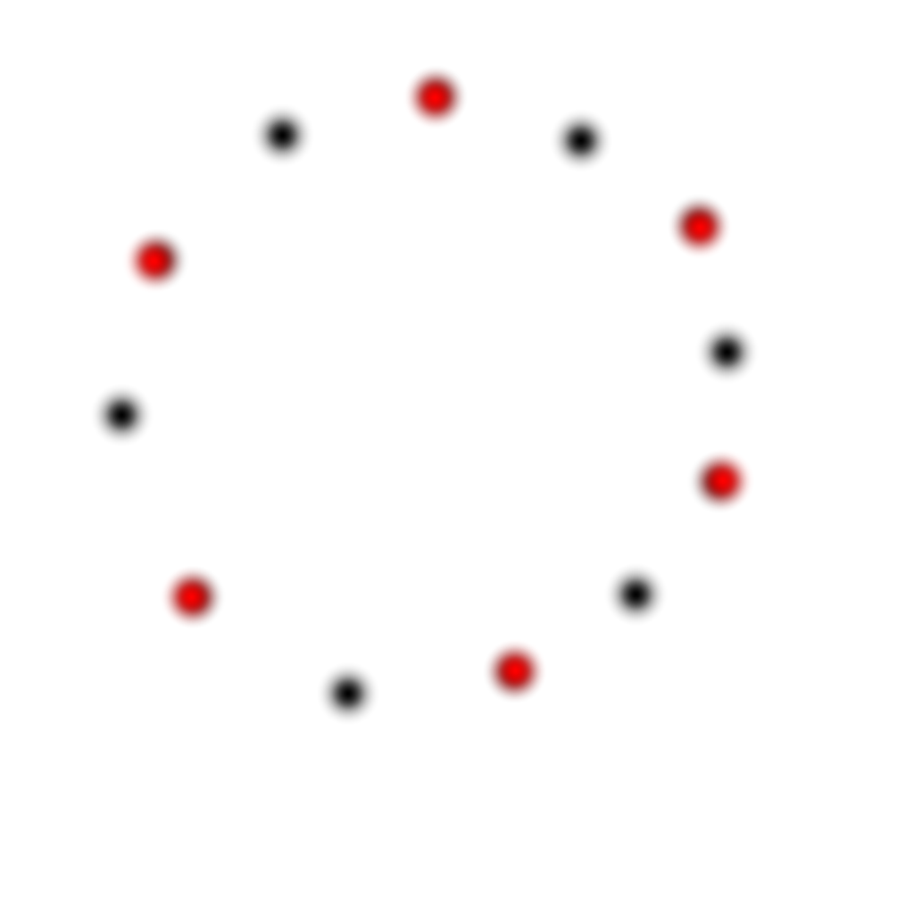

The first thing to know should be the radius and the center point of the circle. To find them,
we pick a number of representative (sample) points (`GESTURE_CIRCLE_SAMPLES`) to save the arduino some work.
If we have enough points (at least the number of sample points), we find the greatest distance for every
of these points to any other point of the circle. We also sum up all point coordinates to find the circle center
by just calculating the average point coordinates. 

Because the greatest distance to another point of the circle is the diameter, it should be nearly
the same for all our sample points. To test this, we calculate the average radius and determine
the standard deviation of this radius to the distance of every point of the circle from the center.
For a perfect circle, this deviation would be 0. 
We also want closed circles, so we determine the distance from start to end point of the data set.

Of course, users can't draw perfect circles. That is why we need to add some tolerance, but also some restrictions
to destinguish a circle from other gestures:

 * Minimum diameter of `CIRCLE_MIN_DIAMETER`.
 * Maximum standard deviation from the circle radius of `CIRCLE_MAX_DEVIATION`.
 * Maximum distance of circle ends of `MAX_ENDS_DISCANCE`.

If our data matches these restrictions, we still have to decide if clockwise or counterclockwise.
This is done by keeping track of the minimum and maximum X coordinates and the maximum Y coordinate and their
respective point indices. The order of these indices tells us the orientation of the circle.
If the data does not match a circle, the process continues to arm rotation evaluation.

### Arm Rotation Evaluation

Again, we have to gather some statistical data. This time, we calculate the variance (sqared standard deviation) of the
X and Y coordinates to their respective other axis. In other words: How far do points deviate from
the X or Y axis? 
Because vertical movement is typically a little more limited than horizontal movment, or at least percieved
as such, the deviation in Y-direction is multiplied with the `Y_DEVIATION_CORRECTION` factor.

For a gesture to be recognized as arm rotation, the following conditions have to be met:

 * X and Y variance smaller than ROTATION_MAX_VARIANCE
 * An absolute arm rotation angle of more than ROTATION_MIN_ANGLE
 
If no arm rotation movement is recognized, the process proceeds to straight movement evaluation.

### Straight Movement Evaluation

The straight movement evaluation uses two new parameters: the relation of X and Y deviation and the distance
from the point (0, 0).
They are used to test the straight movement conditions:

 * Distance from (0, 0) greater than `STRAIGHT_MIN_DISTANCE`
 * X deviation greater than Y deviation and relation of deviations greater than 1/(`STRAIGHT_MAX_RELATION`)? -> Horizontal movement
 * Y deviation greater than X deviation and relation of deviations smaller than `STRAIGHT_MAX_RELATION`? -> Vertical movement

If no gestures are recognized in this step, the gesture is not recognizable, and thus `ARM_UNKNOWN`.
